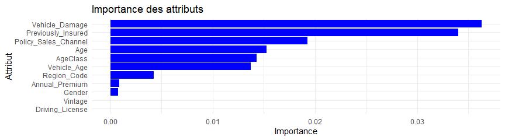

\pagestyle{fancyplain} 
\fancyfoot{}
\footskip=0cm
\renewcommand{\footrulewidth}{0pt}
\renewcommand{\footruleskip}{10pt}
\fancyfoot[L]{Luc Allart, Erwan-Henri Burlisson}
\fancyfoot[R]{\thepage  /\pageref{LastPage}}
\fancyfoot[C]{}


\newpage


```{r setup, include=FALSE}
knitr::opts_chunk$set(echo = FALSE)
knitr::opts_chunk$set(fig.width=6, fig.height=3, dpi=96)
```


```{r,echo=FALSE, results='hide', message=FALSE, warning=FALSE}
# Installer et charger les bibliothèques nécessaires
if (!require("ggplot2")) install.packages("ggplot2")
if (!require("caret")) install.packages("caret")
if (!require("xgboost")) install.packages("xgboost")
if (!require("pROC")) install.packages("pROC")
if (!require("ggplot2")) install.packages("ggplot2")
if (!require("yardstick")) install.packages("yardstick")
if (!require("DALEX")) install.packages("DALEX")
if (!require("iml")) install.packages("iml")
if (!require("FSelector")) install.packages("FSelector")
if (!require("ROSE")) install.packages("ROSE")
if (!require("dplyr")) install.packages("dplyr")
if (!require("pROC")) install.packages("pROC")
library(pROC)
library(dplyr)
library(ROSE)
library(RColorBrewer)
library(FSelector)
library(ggplot2)
library(caret)
library(xgboost)
library(pROC)
library(yardstick)
library(DALEX)
library(iml)
library(caret)
library(randomForest)
library(xgboost)
library(e1071)
library(naivebayes)
library(MASS)
```


# Introduction

Dans le cadre de ce projet de Master 2 à l'ISUP, nous avons pour objectif de développer un modèle prédictif pour une compagnie d’assurance. Ce modèle devra déterminer la probabilité qu'un client ayant souscrit une assurance santé s'intéresse également à une assurance véhicule. Cette prédiction permettra à la compagnie d’optimiser ses stratégies de communication et de maximiser ses revenus en ciblant les clients les plus susceptibles de souscrire à une nouvelle assurance.

Les données utilisées dans ce projet proviennent de Kaggle, où elles ont été initialement proposées dans le cadre d’une compétition intitulée **Health Insurance Cross Sell Prediction** (https://www.kaggle.com/datasets/anmolkumar/health-insurance-cross-sell-prediction). La compétition avait pour objectif de prédire si **un client actuel serait-il intéressé par une assurance véhicule ?** En utilisant les informations des clients.

## Critère de notation

Le critère de performance utilisé pour cette compétition était le **score ROC_AUC** (Receiver Operating Characteristic - Area Under the Curve), une métrique largement utilisée pour évaluer les performances des modèles de classification. Ce test évalue spécifiquement la capacité du modèle à prédire correctement la variable cible **`Response`**, qui indique si un client est intéressé par l'assurance véhicule (`1`) ou non (`0`).

## Contexte des données

Les données fournies ne précisent pas le pays d’origine de l’assureur ou du portefeuille étudié. Cela limite certaines interprétations concernant le contexte socio-économique ou réglementaire, mais cela ne remet pas en question l’objectif d’analyse et de modélisation. Nous supposerons donc que les informations données sont génériques et applicables à un contexte international.

# Description des données

Les données utilisées pour ce projet sont structurées comme suit : 

## Variables et leur définition

| **Variable**               | **Définition**                                                                 |
|-----------------------------|-------------------------------------------------------------------------------|
| `id`                        | Identifiant unique pour chaque client                                        |
| `Gender`                    | Genre du client                                                             |
| `Age`                       | Âge du client                                                              |
| `Driving_License`           | 1 : Le client possède un permis, 0 : Le client n’a pas de permis            |
| `Region_Code`               | Code unique pour la région du client                                        |
| `Previously_Insured`        | 1 : Le client a déjà une assurance véhicule, 0 : Pas d’assurance véhicule   |
| `Vehicle_Age`               | Âge du véhicule                                                            |
| `Vehicle_Damage`            | 1 : Le véhicule a été endommagé, 0 : Pas de dommage                       |
| `Annual_Premium`            | Montant de la prime annuelle                                                |
| `Policy_Sales_Channel`      | Code anonymisé pour le canal de vente utilisé                               |
| `Vintage`                   | Nombre de jours depuis l’association du client avec l’entreprise            |
| **`Response`**              | <span style="color:red; font-weight:bold;">1 : Le client est intéressé, 0 : Pas d’intérêt</span> |


## Structure des données et variable cible

Le jeu de données contient deux tables principales : 

-  **Données d'entraînement ** : utilisées pour entraîner et tester le modèle (380 000 individus).
-  **Données de test ** : Cette base de donnée utilisée pour la soumission du hackathon ne contient pas la variable reponse et ne sera donc pas utilisée

Chaque observation correspond à un client unique avec ses caractéristiques et son intérêt ou non pour l’assurance véhicule.


```{r}
data <- read.csv("C:/Users/FLOWUP/Downloads/train.csv")
#test_df <- read.csv("C:/Users/FLOWUP/Downloads/test.csv")
data <- data[, !(names(data) %in% "id")]
```

```{r}
count_plot <- function(df, feat,title, palette = "rainbow") {
  # Obtenir les étiquettes et les valeurs
  labels <- table(df[[feat]])
  values <- as.vector(labels)
  names <- names(labels)
  
  # Créer le graphique
  palette_colors <- ifelse(palette == "rainbow", rainbow(length(labels)), brewer.pal(length(labels), palette))
  
  plot <- ggplot(data = data.frame(labels = names, value = values), aes(x = labels, y = values)) +
    geom_bar(stat = "identity", fill = palette_colors, alpha = 0.75) +
    geom_text(aes(label = values), vjust = -0.3) +
    ggtitle(title) +
    theme_minimal() +
    theme(plot.title = element_text(size = 15, face = "bold"))
  
  print(plot)
}

```

### variable cible : Response

La variable cible dans notre analyse est **`Response`**, où :

- `1` signifie que le client est **intéressé par l'assurance véhicule**.
- `0` signifie que le client **n'est pas intéressé par l'assurance véhicule**.

Ce projet est donc une **tâche de classification binaire**, où l'objectif est de prédire si un client existant serait intéressé par une assurance véhicule.


```{r my_plot_1, fig.path='figures/', dev='png',echo=FALSE, include=FALSE, results='hide',  message=FALSE, warning=FALSE}
count_plot(data, "Response", "Reponse du client")
```


*Déséquilibre des classes*

En analysant la distribution de la variable cible `Response`, nous constatons un **déséquilibre important** entre les deux classes (`0` et `1`). Ce type de déséquilibre est courant dans les jeux de données réels, mais il peut nuire à la performance des modèles de classification, car ils ont tendance à privilégier la classe majoritaire.

Pour pallier ce problème, nous pouvons utiliser des techniques de **suréchantillonnage** (oversampling) ou **sous-échantillonnage** (undersampling).

*Suréchantillonnage et sous-échantillonnage*

Ces techniques sont utilisées pour ajuster la répartition des classes dans un jeu de données, et elles sont courantes en apprentissage automatique et en analyse statistique :

- **Suréchantillonnage** : Augmente le nombre d'exemples de la classe minoritaire en dupliquant des observations ou en générant de nouvelles données synthétiques. Par exemple, l'algorithme SMOTE (Synthetic Minority Oversampling Technique) est souvent utilisé.
- **Sous-échantillonnage** : Réduit le nombre d'exemples de la classe majoritaire pour équilibrer les classes, mais cela peut entraîner une perte d'informations.

*Approche proposée*

Pour notre analyse, nous examinerons si l'impact du  **suréchantillonnage**  permet d'augmenter la précision globale ou la sensibilité aux prédictions de la classe minoritaire.


### Etude de la variable : Gender

En analysant la variable **`Gender`**, qui représente le genre des clients, nous constatons que la distribution des données est **équilibrée**. Cela signifie que les deux catégories (hommes et femmes) sont représentées de manière à peu près égale dans le jeu de données.

*Observation*

La présence d'une distribution équilibrée pour cette variable est importante, car cela réduit le risque de biais potentiel dans les modèles de classification qui pourraient autrement surpondérer une catégorie en raison d'un déséquilibre. Nous n'avons donc pas besoin d'appliquer des techniques de rééquilibrage pour cette variable.

```{r my_plot_2, fig.path='figures/', dev='png',echo=FALSE, include=FALSE, results='hide', message=FALSE, warning=FALSE}
count_plot(data, "Gender", "Répartition homme femme")
```
| **Genre**               | **Nombre**                                                                 |
|-----------------------------|-------------------------------------------------------------------------------|
| `Male`                        | 206 089                                     |
| `Female`                    | 175 020                                                            |


### Etude de la variable : Age

L’âge des clients peut avoir une influence significative sur leur intérêt pour l’assurance véhicule. Pour mieux comprendre cette relation, nous avons regroupé les âges en classes afin d'analyser la répartition des réponses (`Response`) en fonction des tranches d'âge.

```{r my_plot_3, fig.path='figures/', dev='png', echo=FALSE, include=FALSE, results='hide', message=FALSE, warning=FALSE}
data_0 <- data[data$Response == 0, ]
data_1 <- data[data$Response == 1, ]

# Créer le graphique
ggplot() +
  geom_density(data = data_0, aes(x = Age, fill = "0"), alpha = 0.5) +
  geom_density(data = data_1, aes(x = Age, fill = "1"), alpha = 0.5) +
  scale_fill_manual(values = c("0" = "blue", "1" = "red"), name = "Response") +
  labs(title = "Distribution of Age by Response", x = "Age", y = "Density") +
  theme_minimal() +
  theme(legend.position = "top")
bins <- c(20, 30, 40, 50, 60, 70, 80, 90)
labels <- c('20-29', '30-39', '40-49', '50-59', '60-69', '70-79', '80+')
data$AgeClass <- cut(data$Age, breaks = bins, labels = labels, include.lowest = TRUE)
```


*Observations initiales*

Certaines tranches d’âge semblent montrer un plus grand intérêt pour l’assurance véhicule, tandis que d’autres en montrent moins. Cela pourrait indiquer une tendance ou un comportement spécifique à certaines catégories démographiques. Par exemple :

- Les clients âgés de **40-49 ans** et **70-79 ans** semblent avoir un intérêt notable.
- Les jeunes adultes (20-29 ans) pourraient être moins intéressés, mais cela nécessitera une analyse plus approfondie.

*Groupement des âges*

Cette classification permet d’identifier les tendances globales tout en simplifiant l’analyse.


```{r my_plot_4, fig.path='figures/', dev='png', echo=FALSE, include=FALSE, results='hide', message=FALSE, warning=FALSE}
count_plot(data, "AgeClass", "Les classes d'age des clients")
```


### Etude de la variable : Vehicle Damage

Analyser la relation entre l'âge des clients et les dommages aux véhicules peut fournir des informations utiles pour mieux comprendre les comportements des clients et leur probabilité d'intérêt pour une assurance véhicule.

*Observation *

D’après les données, il semble que les personnes âgées soient plus susceptibles de posséder des véhicules ayant subi des dommages. Cela pourrait s'expliquer par plusieurs facteurs :

- Les conducteurs plus âgés possèdent peut-être des véhicules plus anciens ou moins bien entretenus.
- Ils peuvent également avoir un comportement de conduite différent, influençant le risque de dommages.


```{r my_plot_5, fig.path='figures/', dev='png', echo=FALSE, include=FALSE, results='hide', message=FALSE, warning=FALSE}
ggplot(data, aes(x = Vehicle_Damage, y = Age, fill = Gender)) +
  geom_boxplot() +
  theme_minimal() +
  theme(panel.grid = element_blank()) +  # Équivaut au style 'ticks' de seaborn
  labs(x = "Vehicle_Damage", y = "Age", title = "Boxplot of Age by Vehicle Damage and Gender") +
  scale_fill_brewer(palette = "Set2")  # Palette pour différencier les genres
```


# Prétraitement des Données

## Détection de valeurs aberrantes et manquantes

*Definition of Outliers*

En statistique, un **outlier** (ou valeur aberrante) est un point de données qui diffère significativement des autres observations. Les outliers peuvent apparaître pour plusieurs raisons :

- **Variabilité dans les mesures** : Certaines valeurs extrêmes peuvent être des cas valides, mais inhabituels.
- **Erreurs expérimentales** : Ces erreurs peuvent provenir de problèmes de saisie ou de mesure et doivent souvent être corrigées ou exclues.

Les outliers peuvent causer de sérieux problèmes dans les analyses statistiques en influençant de manière disproportionnée les résultats, en particulier dans des modèles sensibles comme la régression.

*Nous allons utilisé la méthode "Using Interquartile Range (IQR)" pour la détection de valeurs aberrantes*

L’**intervalle interquartile (IQR)** est une méthode couramment utilisée pour détecter les outliers dans un jeu de données. Cette méthode repose sur les quartiles :

- **Q1** : Le 1er quartile représente la valeur sous laquelle se trouve 25 % des données.
- **Q3** : Le 3ème quartile représente la valeur sous laquelle se trouve 75 % des données.
- **IQR** : Calculé comme la différence entre Q3 et Q1 (\(IQR = Q3 - Q1\)).

Un point est considéré comme un **outlier** s’il se situe :

- En dessous de \(Q1 - 1.5 \times IQR\),
- Au-dessus de \(Q3 + 1.5 \times IQR\).

```{r, separation catégorie vs numerique }
data_cats <- c('Gender', 'Driving_License', 'Region_Code', 'Previously_Insured', 
               'Vehicle_Age', 'Vehicle_Damage', 'Policy_Sales_Channel', 
               'Vintage', 'AgeClass')
data_nums <- c('Age', 'Annual_Premium')
```

```{r, echo=FALSE, include =FALSE, results='hide'}
missing <- colSums(is.na(data))
missing

detect_outliers <- function(df, feat) {
  Q1 <- quantile(df[[feat]], 0.25, na.rm = TRUE)
  Q3 <- quantile(df[[feat]], 0.75, na.rm = TRUE)
  IQR <- Q3 - Q1
  # Calcul des valeurs aberrantes
  outliers <- sum(df[[feat]] < (Q1 - 1.5 * IQR) | df[[feat]] > (Q3 + 1.5 * IQR), na.rm = TRUE)
  return(outliers)
}

clean_outliers <- function(df, feat) {
  Q1 <- quantile(df[[feat]], 0.25, na.rm = TRUE)
  Q3 <- quantile(df[[feat]], 0.75, na.rm = TRUE)
  IQR <- Q3 - Q1
  # Filtrer les données sans les valeurs aberrantes
  df <- df[!(df[[feat]] < (Q1 - 1.5 * IQR) | df[[feat]] > (Q3 + 1.5 * IQR)), ]
  return(df)
}

for (feat in data_nums) {
  res <- detect_outliers(data, feat)
  if (res > 0) {
    cat(sprintf("%d Outlier(s) detected in feature %s\n", res, feat))
  }
}

# Nettoyer les valeurs aberrantes
data <- clean_outliers(data, "Annual_Premium")

# Vérifier la taille du dataframe
dim(data)
```

*Conclusion*

**Valeurs manquantes** : Aucune valeur manquante n'a été détectée dans le jeu de données.

**Valeurs aberrantes (outliers)** :

- La variable **`Annual_Premium`** contient **10 320 outliers** détectés à l'aide de la méthode de l'intervalle interquartile (IQR).
- Ces valeurs aberrantes pourraient influencer négativement les résultats de l'analyse et les performances des modèles prédictifs.

Pour garantir la robustesse des analyses et des modèles, nous avons décidé de **supprimer les lignes contenant des valeurs aberrantes** dans la variable `Annual_Premium`. Cette approche permet de travailler avec des données plus homogènes tout en réduisant l'impact des valeurs extrêmes sur les résultats.


## Division en ensembles d'entraînement et de test et encodage des variables catégoriques

### Division en ensembles d'entraînement et de test

Pour entraîner et évaluer le modèle, nous divisons les données nettoyées en deux ensembles :

- **Ensemble d'entraînement** : 67 % des données, utilisé pour construire le modèle.
- **Ensemble de test** : 33 % des données, utilisé pour évaluer les performances du modèle sur des données non vues.


```{r, separation en test/train}
set.seed(1)  # Fixer une seed pour la reproductibilité
train_index <- createDataPartition(data$Response, p = 0.67, list = FALSE)

data_train <- data[train_index, ]
test_df <- data[-train_index, ]
y_test=test_df$Response
```


### Encodage des variables catégoriques

Les variables catégorielles doivent être encodées pour être utilisées dans les modèles d’apprentissage automatique. Dans ce projet, nous avons appliqué l'**Ordinal Encoding**. Méthode utilisée lorsque l’ordre des catégories est important (par exemple : **"cold", "warm", "hot"**). Cela permet de représenter chaque catégorie par une valeur numérique correspondant à son rang.

Gestion des valeurs inconnues :

Lors de l'encodage, nous avons remarqué que deux lignes dans l'ensemble de test contenaient des valeurs inconnues pour la variable **`Policy_Sales_Channel`** (`141` et `142`). Ces catégories n'étant pas présentes dans l'ensemble d'entraînement, nous les avons remplacées par une catégorie existante (`140`) afin de garantir une cohérence entre les ensembles de données.


```{r, encodage des catégorie}
# Fonction pour effectuer un encodage ordinal
ordinal_encode <- function(data, categorical_columns) {
  for (col in categorical_columns) {
    data[[col]] <- as.numeric(factor(data[[col]]))
  }
  return(data)
}

# Appliquer l'encodage ordinal aux données catégoriques
X_train_enc <- ordinal_encode(data_train[data_cats], data_cats)
X_test_enc <- ordinal_encode(test_df[data_cats], data_cats)

# Gestion des valeurs inconnues 
test_df$Policy_Sales_Channel[test_df$Policy_Sales_Channel == 141] <- 140
test_df$Policy_Sales_Channel[test_df$Policy_Sales_Channel == 142] <- 140

# Ajouter les colonnes numériques aux colonnes encodées
all_train_enc  <- cbind(X_train_enc, data_train[data_nums])
all_test_enc  <- cbind(X_test_enc, test_df[data_nums])
```


## Sélection de variables

La sélection des variables est une étape essentielle dans la construction d’un modèle d’apprentissage automatique, car elle permet de réduire la complexité, d'améliorer les performances et de diminuer le risque de surapprentissage.

*Observations sur l'importance des variables*

Le graphique ci-dessous montre l'importance des variables calculée à l’aide de cette méthode :

- **`Vehicle_Damage`** et **`Previously_Insured`** sont les deux variables les plus importantes pour prédire l'intérêt pour l'assurance véhicule.
- **`Age`** et **`AgeClass`** ont une importance similaire, ce qui montre que l'ajout de `AgeClass` comme nouvelle variable ne perd pas d'information significative.
- Les variables comme **`Vintage`** et **`Driving_License`** ont des scores très faibles et pourraient être supprimées sans affecter les performances du modèle.


```{r my_plot_6, fig.path='figures/', dev='png',echo=FALSE, include=FALSE, results='hide',  message=FALSE, warning=FALSE, fig.width=9, fig.height=2.5}
# Fusionner les données et cible pour FSelector
train_data <- cbind(all_train_enc, Response = data_train$Response)

# Utiliser mutual information pour la sélection de caractéristiques
mutual_info_scores <- information.gain(Response ~ ., data = as.data.frame(train_data))

# Afficher les scores
data_plot <- data.frame(
  Attribute = rownames(mutual_info_scores),
  Importance = mutual_info_scores
)

ggplot(data_plot, aes(x = reorder(Attribute, attr_importance), y = attr_importance)) +
  geom_bar(stat = "identity", fill = "blue") +
  coord_flip() + # Inverser les axes pour un graphique horizontal
  labs(
    title = "Importance des attributs",
    x = "Attribut",
    y = "Importance"
  ) +
  theme_minimal()

```



## Suréchantillonnage avec ROSE

Dans notre projet, nous avons observé un déséquilibre dans la distribution de la variable cible **`Response`**. Ce déséquilibre peut affecter les performances des modèles prédictifs, car ils risquent de privilégier la classe majoritaire. Pour résoudre ce problème, nous appliquons un **suréchantillonnage** à l'aide du package **ROSE**.


*Méthode utilisée : ROSE (Random Over-Sampling Examples)*

Le package **ROSE** propose une approche de suréchantillonnage qui génère des données synthétiques pour équilibrer les classes. Contrairement au simple suréchantillonnage (duplication des observations de la classe minoritaire), ROSE crée de nouvelles observations basées sur une approche probabiliste, ce qui améliore la diversité et réduit le risque de surajustement.

```{r}
# Installer et charger le package ROSE

# Fusionner les prédicteurs et la cible
train_data <- data.frame(all_train_enc, Response = data_train$Response)

# Appliquer ROSE pour un suréchantillonnage
set.seed(42)  # Fixer la graine pour la reproductibilité
oversampled_data <- ROSE(Response ~ ., data = train_data, seed = 42)$data

# Séparer les prédicteurs et la cible après suréchantillonnage
all_train_enc_over_sampled <- oversampled_data[, !names(oversampled_data) %in% "Response"]
y_train_over_sampled <- oversampled_data$Response

# Mettre à jour y_train avec les données suréchantillonnées
y_train <- y_train_over_sampled

```


## Normalisation des jeux de données 

La normalisation est une étape cruciale pour standardiser les données avant de les utiliser dans des algorithmes de modélisation. Cette étape garantit que toutes les variables ont une échelle comparable, ce qui est particulièrement important pour les modèles sensibles aux écarts de valeurs (par exemple, la régression logistique, les réseaux neuronaux ou les SVM).


*Méthode utilisée : Normalisation avec `caret`*

Nous avons utilisé la bibliothèque **caret** pour appliquer une normalisation sur les ensembles de données d'entraînement et de test. Les étapes sont les suivantes :

- Entraîner un normaliseur sur l'ensemble d'entraînement encodé.
- Transformer les ensembles d'entraînement et de test pour centrer les données (moyenne = 0) et les réduire (écart-type = 1).

*Après normalisation :*

- Les données sont centrées (moyenne = 0) et réduites (écart-type = 1).
- Cela améliore la performance des algorithmes de modélisation en garantissant que toutes les variables contribuent équitablement.


```{r}
# Charger la bibliothèque caret pour la normalisation

# Entraîner le normaliseur
scaler <- preProcess(all_train_enc, method = c("center", "scale"))

# Transformer les ensembles de données
X_train_transformed <- predict(scaler, all_train_enc_over_sampled)
X_test_transformed <- predict(scaler, all_test_enc)
```


# Entrainement et comparaison des modèles

Dans cette section, nous avons entraîné plusieurs modèles d'apprentissage supervisé sur les données transformées et suréchantillonnées. L'objectif est de comparer leurs performances en termes de **ROC AUC**, une métrique appropriée pour les problèmes de classification déséquilibrés.


## Modèles entraînés

Les modèles suivants ont été évalués :

1. **GLM (Generalized Linear Model)** : Régression logistique classique
La régression logistique est un modèle linéaire généralisé adapté aux données binaires (ou multicatégorielles). Elle prédit la probabilité d’appartenance à une classe en appliquant une fonction logistique (sigmoïde) à une combinaison linéaire des variables explicatives.
2. **Naive Bayes** : Modèle probabiliste basé sur le théorème de Bayes
Naive Bayes est un modèle de classification basé sur le théorème de Bayes, supposant l’indépendance conditionnelle des variables explicatives. Il calcule la probabilité d'appartenance d'un individu à chaque classe et choisit la classe avec la probabilité la plus élevée.
3. **GBM (Gradient Boosting Machine)** : Modèle de boosting pour améliorer la performance
GBM construit un ensemble de modèles faibles (typiquement des arbres de décision) de manière séquentielle. Chaque nouveau modèle corrige les erreurs commises par les modèles précédents, en minimisant une fonction de perte grâce à une descente de gradient.
4. **XGBoost sans suréchantillonnage** : XGBoost est une version optimisée de GBM qui utilise des techniques avancées (régularisation, gestion efficace de la mémoire) pour améliorer la vitesse et les performances. Dans cette version, l’algorithme est entraîné sur les données originales, non équilibrées, ce qui peut conduire à un biais en cas de classes déséquilibrées.
5. **XGBoost avec suréchantillonnage** : Cette version de XGBoost est entraînée sur des données équilibrées à l’aide de la méthode ROSE (Random OverSampling Examples), qui crée des échantillons synthétiques pour la classe minoritaire. Cela vise à atténuer les effets du déséquilibre des classes et à améliorer la performance sur la classe minoritaire.

Tous les modèles sont entraînés en utilisant la fonction `caret::train()`. Et on utilise la méthode de validation croisée (5-fold) pour évaluer les performances des modèles avec comme métrique principale : **ROC AUC**. 


```{r,cache=TRUE,echo=FALSE, include=FALSE, results='hide', message=FALSE, warning=FALSE}
# Chargement des bibliothèques nécessaires


# Étape 1 : Préparation
y_train2 <- factor(y_train, levels = c("0", "1"), labels = c("Class0", "Class1"))
X_train_transformed2 <- data.frame(X_train_transformed, Response = y_train2)

# préparation sans sur echantillonage
y_train3 <- factor(data_train$Response, levels = c("0", "1"), labels = c("Class0", "Class1"))
X_train_transformed3 <- data.frame(all_train_enc, Response = y_train3)
flag_sur=0


model_results <- data.frame()
results <- list()
names <- character()
models <- c("glm","naive_bayes" ,"gbm","xgbTree","xgbTree")# "rf",
row_number <- 1
cv <- trainControl(method = "cv", number = 5, classProbs = TRUE, summaryFunction = twoClassSummary)

#Entrainement
for (model_name in models) {
  cat(sprintf("Training %s model\n", model_name))
  if(model_name!="xgbTree")
  {
  cv_results <- caret::train(Response ~ .,data = X_train_transformed2, method = model_name, trControl = cv,metric = "ROC")
  }
  else{
    if(flag_sur==0){
      cv_results <- caret::train(Response ~ .,data = X_train_transformed3, method = "xgbTree", trControl = cv,metric = "ROC")
      flag_sur=1
    }else {
    cv_results <- caret::train(Response ~ .,data = X_train_transformed2, method = model_name, trControl = cv,metric = "ROC")
    flag_sur=2
    }
  }
  if(flag_sur==1){
    model_results[row_number, "Model Name"] <- "xgbTree sans surechantillonage"
  }else {
    model_results[row_number, "Model Name"] <- model_name
  }
  
  model_results[row_number, "Train roc_auc Mean"] <- mean(cv_results$results$ROC)
  #model_results[row_number, "Fit Time Mean"] <- mean(cv_results$results$timings)
  results[[row_number]] <- cv_results
  row_number <- row_number + 1
}
```

### Résultats des modèles

```{r,echo=FALSE, results='hide', message=FALSE, warning=FALSE}
# Étape 6 : Afficher les résultats
print(model_results)

```


```{r, my_plot_C, fig.path='figures/', dev='png', echo=FALSE, include=FALSE, results='hide', message=FALSE, warning=FALSE}
# Créer une liste pour les résultats de validation croisée
cv_results_array <- matrix(0,nrow = 5, ncol=length(results))

# Récupérer les scores de test pour chaque modèle
for (model_name in seq(1,length(results))) {
  cv_results_array[1:5,model_name] <- results[[model_name]]$resample$ROC
}

# Transformer les données pour un format long
cv_results_df <- as.data.frame(cv_results_array)
models <- c("glm","naive_bayes" ,"gbm","xgbTree","xgbTree surechantilloné")
colnames(cv_results_df) <- models
cv_results_long <- reshape2::melt(cv_results_df, variable.name = "Model", value.name = "ROC")

# Créer le graphique boxplot
library(ggplot2)

ggplot(cv_results_long, aes(x = Model, y = ROC, fill = Model)) +
  geom_boxplot() +
  labs(title = "Comparaison des modèles",
       x = "Modèles",
       y = "Score ROC AUC") +
  theme_minimal() +
  theme(legend.position = "none")

```


Les résultats moyens de la métrique **ROC AUC** sur l'ensemble d'entraînement sont les suivants :

| **Model Name**                   | **Train ROC AUC Mean** |
|----------------------------------|------------------------|
| GLM                              | 0.8114                |
| Naive Bayes                      | 0.9622                |
| GBM                              | 0.9811                |
| XGBoost sans suréchantillonnage  | 0.8539                |
| XGBoost surechantilloné          | 0.9845                |


*Observations*

1. **Meilleure performance** :
   - Le modèle **XGBoost avec suréchantillonnage** a obtenu le **ROC AUC le plus élevé (0.9845)**, confirmant l'importance du rééquilibrage des données pour améliorer les performances.

2. **Performance du Naive Bayes** :
   - Malgré sa simplicité, le modèle Naive Bayes a atteint un ROC AUC élevé (0.9622), démontrant sa robustesse dans les données équilibrées.

3. **Impact du suréchantillonnage** :
   - Comparativement à **XGBoost sans suréchantillonnage (0.8539)**, l’utilisation de données équilibrées a significativement amélioré les performances.


*Conclusion*

Le modèle **XGBoost avec suréchantillonnage** est identifié comme le meilleur candidat pour résoudre ce problème de classification. Les prochaines étapes consisteront à tester ce modèle sur l'ensemble de test et à analyser ses performances sur des données non vues.


## Modèle Sélectionné : XGBoost

Dans cette section, nous évaluons les performances du modèle **XGBoost**.


### Résultats de l'évaluation (sur l'ensemble de test)

**ROC AUC** : La valeur de **ROC AUC** obtenue est de **0.7553**. 
   
**Erreur de classification** : Le taux d'erreur de classification est de **42.74 %**. 


```{r,cache=TRUE,echo=FALSE, results='hide', message=FALSE, warning=FALSE}
# Charger la bibliothèque pROC pour calculer l'AUC


# Prédire les probabilités pour l'ensemble de test
y_scores <- predict(cv_results, as.matrix(X_test_transformed))
y_scores=factor(y_scores, levels = c("Class0", "Class1"), labels = c("0", "1"))
# Calculer l'AUC

roc_auc <- roc(as.numeric(y_test), as.numeric(y_scores))
auc_value <- roc_auc$auc

# Afficher l'AUC
cat(sprintf("ROC AUC: %.4f\n", auc_value))

# Calcul de l'erreur de classification
error_rate <- mean(y_scores != as.numeric(y_test))
cat(sprintf("Classification Error: %.4f\n", error_rate))
```

Le graphique ci-dessous représente la **courbe ROC** obtenue pour le modèle **XGBoost** sur l'ensemble de test.

```{r my_plot_8, fig.path='figures/', dev='png', echo=FALSE, include=FALSE, results='hide', message=FALSE, warning=FALSE}
# Extraire FPR (1-Spécificité), TPR (Sensibilité), et seuils
fpr <- 1 - roc_auc$specificities
tpr <- roc_auc$sensitivities
auc_value <- roc_auc$auc

# Tracer la courbe ROC
plot(fpr, tpr, type = "l", col = "blue", lwd = 2, main = "XGBoost ROC Curve",
     xlab = "FPR (1 - Specificity)", ylab = "TPR (Sensitivity)")
abline(a = 0, b = 1, lty = 2, col = "black")  # Diagonale de base (auc = 0.5)

```


*Interprétation :*

- L'axe des abscisses représente le **FPR (1 - Specificité)**, qui mesure les faux positifs.
- L'axe des ordonnées représente le **TPR (Sensibilité)**, qui mesure les vrais positifs.
- La ligne en pointillés représente la ligne de base où **AUC = 0.5**, ce qui correspond à une classification aléatoire.

Le modèle affiche une courbe située au-dessus de la ligne de base, confirmant une performance au-dessus du hasard.


### Prédictions et Matrice de confusion

La matrice de confusion ci-dessous montre les proportions des prédictions correctes et incorrectes. Les données ont été normalisées pour permettre une interprétation claire des pourcentages.


```{r my_plot_9, fig.path='figures/', dev='png', echo=FALSE, include=FALSE, results='hide', message=FALSE, warning=FALSE}
y__train_scores <- predict(cv_results, as.matrix(X_train_transformed))
y__train_scores=factor(y__train_scores, levels = c("Class0", "Class1"), labels = c("0", "1"))
  
# Installer ggplot2 si nécessaire
if (!requireNamespace("ggplot2", quietly = TRUE)) install.packages("ggplot2")

# Chargement des bibliothèques nécessaires
library(ggplot2)
library(dplyr)
library(yardstick)

# Harmoniser les niveaux des facteurs
y <- factor(y_train, levels = c("0", "1"))
predicted_class <- factor(y__train_scores, levels = c("0", "1"))

# Créer un data frame contenant les vérités terrain et les prédictions
df <- data.frame(truth = y, prediction = predicted_class)

# Calculer la matrice de confusion
conf_matrix <- conf_mat(df, truth = truth, estimate = prediction)

# Extraire les données de la matrice
conf_matrix_data <- as.data.frame(conf_matrix$table)

# Normaliser pour afficher des proportions
conf_matrix_data <- conf_matrix_data %>%
  group_by(Truth) %>%
  mutate(Percent = Freq / sum(Freq))

# Plot de la matrice de confusion
g1=ggplot(conf_matrix_data, aes(x = Prediction, y = Truth, fill = Percent)) +
  geom_tile() +
  geom_text(aes(label = sprintf("%.2f", Percent)), color = "white", size = 5) +
  scale_fill_gradient(low = "white", high = "darkgreen") +
  labs(title = "Matrice de confusion", x = "Prédiction", y = "Vérité terrain") +
  theme_minimal()


```

```{r my_plot_10, fig.path='figures/', dev='png', echo=FALSE, include=FALSE, results='hide', message=FALSE, warning=FALSE}
# Créer un data frame contenant les vérités terrain et les prédictions
df <- data.frame(truth = y, prediction = predicted_class)

# Créer un tableau résumant les prédictions correctes et incorrectes
summary_df <- df %>%
  mutate(outcome = case_when(
    truth == prediction ~ "Correct",
    truth != prediction ~ "Incorrect"
  )) %>%
  group_by(truth, outcome) %>%
  summarise(count = n(), .groups = "drop")

# Graphique à barres empilées
g2=ggplot(summary_df, aes(x = truth, y = count, fill = outcome)) +
  geom_bar(stat = "identity") +  # Les barres sont empilées par défaut
  labs(
    title = "Prédictions",
    x = "Classe réelle",
    y = "Nombre",
    fill = "Résultat"
  ) +
  scale_fill_manual(values = c("Correct" = "blue", "Incorrect" = "red")) +
  theme_minimal()
```


```{r my_plot_9_test, fig.path='figures/', dev='png', echo=FALSE, include=FALSE, results='hide', message=FALSE, warning=FALSE}
# Installer ggplot2 si nécessaire
if (!requireNamespace("ggplot2", quietly = TRUE)) install.packages("ggplot2")

# Chargement des bibliothèques nécessaires
library(ggplot2)
library(dplyr)
library(yardstick)

# Harmoniser les niveaux des facteurs
y <- factor(y_test, levels = c("0", "1"))
predicted_class <- factor(y_scores, levels = c("0", "1"))

# Créer un data frame contenant les vérités terrain et les prédictions
df <- data.frame(truth = y, prediction = predicted_class)

# Calculer la matrice de confusion
conf_matrix <- conf_mat(df, truth = truth, estimate = prediction)

# Extraire les données de la matrice
conf_matrix_data <- as.data.frame(conf_matrix$table)

# Normaliser pour afficher des proportions
conf_matrix_data <- conf_matrix_data %>%
  group_by(Truth) %>%
  mutate(Percent = Freq / sum(Freq))

# Plot de la matrice de confusion
g3=ggplot(conf_matrix_data, aes(x = Prediction, y = Truth, fill = Percent)) +
  geom_tile() +
  geom_text(aes(label = sprintf("%.2f", Percent)), color = "white", size = 5) +
  scale_fill_gradient(low = "white", high = "darkgreen") +
  labs(title = "Matrice de confusion", x = "Prédiction", y = "Vérité terrain") +
  theme_minimal()


```

```{r my_plot_10_test, fig.path='figures/', dev='png', echo=FALSE, include=FALSE, results='hide', message=FALSE, warning=FALSE}
# Créer un data frame contenant les vérités terrain et les prédictions
df <- data.frame(truth = y_test, prediction = predicted_class)

# Créer un tableau résumant les prédictions correctes et incorrectes
summary_df <- df %>%
  mutate(outcome = case_when(
    truth == prediction ~ "Correct",
    truth != prediction ~ "Incorrect"
  )) %>%
  group_by(truth, outcome) %>%
  summarise(count = n(), .groups = "drop")

# Graphique à barres empilées
g4=ggplot(summary_df, aes(x = truth, y = count, fill = outcome)) +
  geom_bar(stat = "identity") +  # Les barres sont empilées par défaut
  labs(
    title = "Prédictions",
    x = "Classe réelle",
    y = "Nombre",
    fill = "Résultat"
  ) +
  scale_fill_manual(values = c("Correct" = "blue", "Incorrect" = "red")) +
  theme_minimal()
```


```{r my_plot_9_10, fig.path='figures/', dev='png', echo=FALSE, include=FALSE, results='hide', message=FALSE, warning=FALSE, fig.width=7, fig.height=6}
library(gridExtra)
library(grid)

title_top <- textGrob("Avec l'ensemble d'entrainement", gp = gpar(fontsize = 12, fontface = "bold"))
title_middle <- textGrob("Avec l'ensemble de test", gp = gpar(fontsize = 12, fontface = "bold"))

# Arrangement avec titres
grid.arrange(
  title_top,                         # Titre au-dessus de la première ligne
  arrangeGrob(g1, g2, ncol = 2),     # Première ligne de graphiques
  title_middle,                      # Titre entre les deux lignes
  arrangeGrob(g3, g4, ncol = 2),     # Deuxième ligne de graphiques
  nrow = 4,                          # Nombre total de lignes
  heights = c(0.2, 1, 0.2, 1)        # Proportions des hauteurs des lignes
)
```


*Observations :*

- Dans la matrice de confusion sur l'ensemble d'entrainement :
  - **Classe `0` (Non intéressé)** :
    - **94 %** des instances ont été correctement classées.
    - **6 %** des instances ont été incorrectement classées comme `1`.
  - **Classe `1` (Intéressé)** :
    - **98 %** des instances ont été correctement classées.
    - **2 %** des instances ont été incorrectement classées comme `0`.
- Nous retrouvons les mêmes informations avec le nombre d'individus plutôt que des pourcentages dans le graphique de droite

Pour l'ensemble de test, les résultats sont bien moins convaincants, avec 49 % des 0 prédits comme des 1, mais 100 % des 1 correctement prédits. Cela pourrait s'expliquer par le fait que la base de données de test n'est pas équilibrée entre les 1 et les 0, contrairement à la base d'entraînement.

### SHAP Analysis: Feature Importance and Impact

Les valeurs **SHAP** (SHapley Additive exPlanations) sont utilisées pour expliquer l'impact de chaque caractéristique sur les prédictions du modèle. Cette approche fournit une interprétation globale et locale des modèles complexes, tels que **XGBoost**.


```{r my_plot_11, fig.path='figures/', dev='png', cache=TRUE, echo=FALSE, include=FALSE, results='hide', message=FALSE, warning=FALSE }
library(caret)
library(xgboost)
library(SHAPforxgboost)
xgb_model  <- cv_results$finalModel

X_train_shap <- as.matrix(X_train_transformed)  # Convertir en matrice

# Étape 3 : Calculer les valeurs SHAP
shap_values <- shap.values(xgb_model = xgb_model, X_train = X_train_shap)

# Extraire les scores SHAP
shap_values <- shap.values(xgb_model = xgb_model, X_train = X_train_shap)

# Extraire les scores SHAP et la contribution globale
shap_scores <- shap_values$shap_score

# Étape 4 : Visualiser les valeurs SHAP - Summary Plot
shap_long <- shap.prep(xgb_model = xgb_model, X_train = X_train_shap)
shap.plot.summary(shap_long)


```


*Observations :*

1. **Caractéristiques les plus influentes** :
   - **`Age`** a la plus grande influence sur les prédictions, avec des valeurs SHAP élevées.
   - **`Policy_Sales_Channel`** et **`Vehicle_Damage`** suivent, contribuant également de manière significative aux décisions du modèle.
   
2. **Impact des caractéristiques** :
   - Les caractéristiques avec des valeurs SHAP positives augmentent la probabilité d'appartenir à la classe cible (`1`), tandis que celles avec des valeurs négatives la réduisent.
   - Par exemple, les valeurs élevées de **`Age`** ont un impact positif significatif sur les prédictions.

3. **Importance globale vs locale** :
   - Les caractéristiques comme **`Region_Code`** et **`Driving_License`** ont un impact global plus faible, mais peuvent influencer certaines observations de manière importante.

*Conclusion*

L'analyse SHAP fournit une compréhension approfondie de l'impact des caractéristiques sur les prédictions du modèle :

1. **`Age`, `Policy_Sales_Channel`, et `Vehicle_Damage`** sont les caractéristiques les plus influentes.
2. L'interprétation des valeurs SHAP peut guider des ajustements futurs, comme le raffinement des caractéristiques ou l'exclusion des variables peu informatives.


# Conclusion 

## Objectif et Résultats

Dans le cadre de ce projet, nous avons développé un modèle prédictif visant à déterminer si un client ayant souscrit à une assurance santé serait également intéressé par une assurance véhicule. Ce projet s'est articulé autour des étapes suivantes :

1. **Analyse exploratoire des données** :
   - Identification des tendances importantes dans les variables.
   - Mise en évidence de déséquilibres dans la variable cible `Response`.
2. **Préparation des données** :
   - Nettoyage des données, encodage des variables catégorielles, normalisation et gestion du déséquilibre par suréchantillonnage (ROSE).
3. **Modélisation et évaluation** :
   - Entraînement de plusieurs modèles, incluant GLM, Naive Bayes, Gradient Boosting (GBM) et XGBoost.
   - Évaluation des modèles à l'aide de métriques telles que le **ROC AUC** et la courbe ROC.

## Résultats principaux

1. **Performance du meilleur modèle** :
   - Le modèle **XGBoost avec suréchantillonnage** a obtenu les meilleurs résultats, avec un **ROC AUC de 0.9845** sur l'ensemble d'entraînement.
   - Ce modèle s'est également révélé robuste lors de l'évaluation sur des données de test.

2. **Interprétation des caractéristiques** :
   - L'analyse des valeurs **SHAP** a montré que des variables telles que **`Age`**, **`Policy_Sales_Channel`**, et **`Vehicle_Damage`** étaient les plus influentes dans les prédictions.
   - Des caractéristiques moins influentes, comme **`Vintage`** ou **`Region_Code`**, pourraient être exclues dans de futures itérations.

3. **Gestion du déséquilibre des classes** :
   - L'utilisation de ROSE a permis d'équilibrer les classes, améliorant ainsi la performance des modèles, notamment pour la classe minoritaire (`1` - clients intéressés).

## Limites et Perspectives

1. **Limites** :
   - Le déséquilibre initial de la variable cible a nécessité un suréchantillonnage, ce qui peut introduire des biais si les données synthétiques ne reflètent pas la réalité.
   - Certaines variables, comme **`Region_Code`** ou **`Vintage`**, ont montré un faible impact et pourraient être optimisées ou supprimées.

2. **Perspectives** :
   - Explorer des techniques d'optimisation des hyperparamètres, telles que l'optimisation bayésienne, pour améliorer davantage les performances des modèles.
   - Intégrer des données contextuelles (par exemple, plus d'informations sur les clients ou sur les politiques d’assurance) pour enrichir le modèle.

---

